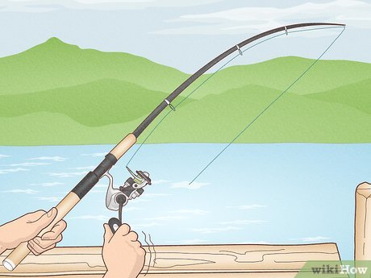
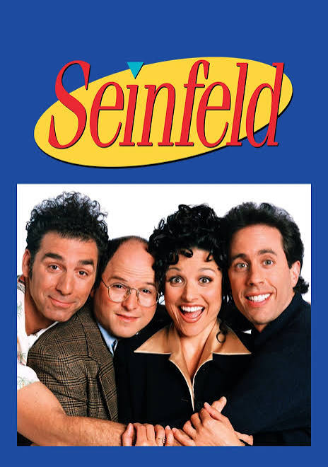
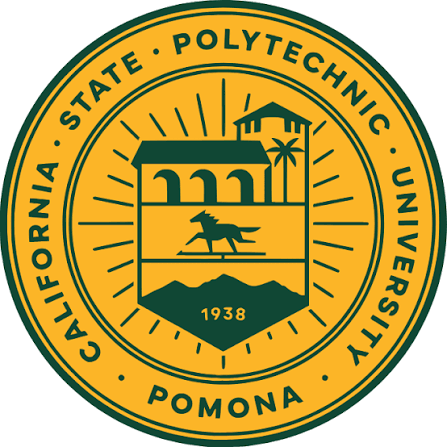
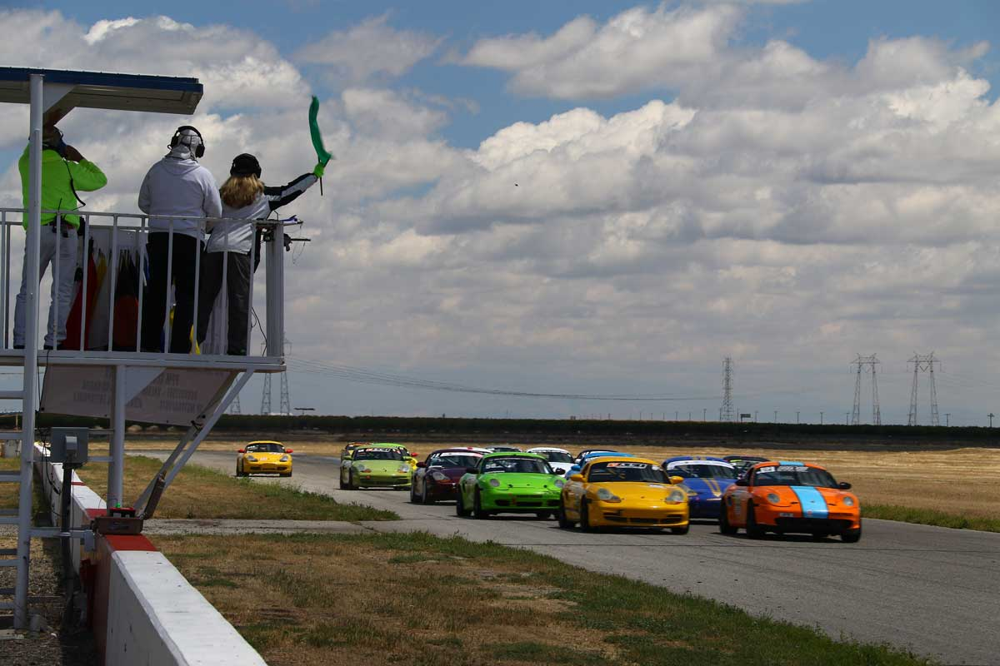

# 
 <u> Me In Markdown </u>
### <u> 
 *By: Arman H* </u>

## 
 **My Letter**

    Hello Mr Aiello, 
    
        My name is Arman, I have taken your AP CSA class and I'm a senior. Over the summer I started watching the show Seinfeld on netflix and I think its a really funny SitCom. I also started learning how to fish recently, I think its really fun when you're actually able to catch fish, outside of that its pretty boring. One fun fact about myself is that I started to do non-competitive racing back in March.

        Racing is fun and I have actually been promoted to drive solo back in June. I hope as I get older and more experienced I can go get a competition license to race competitively to win money and recognition. Over the summer I also went to watch the Backrooms movie with my friends (twice). It is a very good horror movie and I recommend it.

        My future goals for this school year is to get ready for college applications and to get ready to wrap up high school. I hope to end off high school with good grades and to go to a good college. I plan to go into the aerospace engineering field and hope to be able to get a job at Lockheed Martin so I can live near the race tracks and continue racing competitively. 

        I also went travling this year, not outside of the state but I went to Kern county to fish with my dad for 2 days. We went in July and it was very hot. I think it was too hot for the fish cause we couldn't catch any in the 2 days we were fishing, but it was still fun.

## 
 **My Favorite Songs This Summer**

[My Playlist!](https://open.spotify.com/playlist/6fpXDtifGujIILqE7WEEFk?si=RgNaq2UXS5q7ia1vRXV_7A)

## 
 **Some Images From My Summer**

